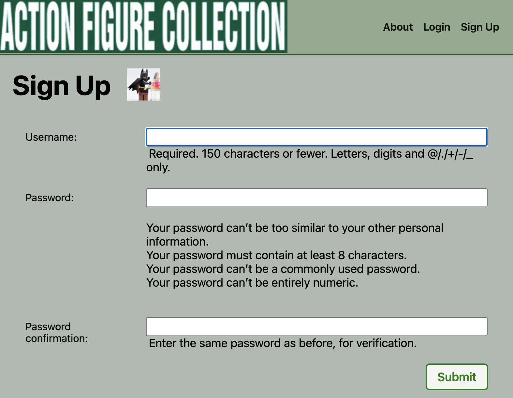

# **Sculpted From Pages**
 
 
 #### If it wasn't for Ralph McQaurrie and his art in the realm of science fiction, George Lucas would not have been able to secure the funds his project would need to create his vision for the screen. With modern directors like Guillermo del Toro and James Gunn, their own original artwork and storyboards still help to illustrate very specific visual ideas to the massive production houses they work alongside. In the world of action figure production, comic artist/writer Todd McFarlane has made a business of translating comic book art into highly detailed collectible figures. Working alongside fellow comic artists like Greg Capullo and Sean Murphy, as well as the the brilliant sculptors and painters working at McFarlane Toys, Todd McFarlane has been able raise the standard of quality for affordable entertainment, **In Full Articulation!**

 Link here:
 [_Join The_ **Action** _Now_!](https://sculpted-from-pages.herokuapp.com/)
 >"I’m tired of trying to get other people to see into my brain. I’m done." -- Todd McFarlane

 ## _Website Technologies_

This version of the app was built with **Python**, **PSQL**, **Django** and **AWS** with the help of _Visual Studio Code_.

## _Website Instructions_

Homepage 

Signing Up

Action Figure List

Adding Figures

Figure Details

Add comics

Comic Details

Comic list

 ## _Icebox_
 * Comic Art Uploading
 * Social Interactivity
 * Trading and Selling
 * Cleaning Schedule